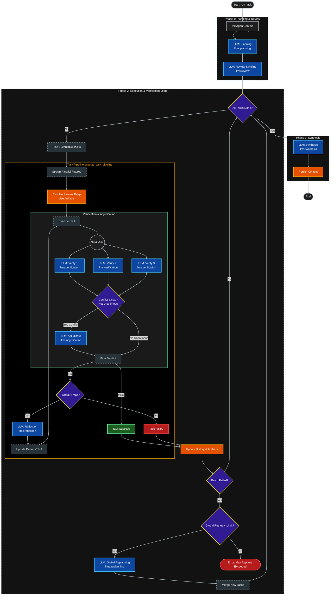

```mermaid
flowchart TD
%% --- 样式定义 ---
%% 基础样式
    classDef default fill:#1e1e1e,stroke:#b0bec5,stroke-width:2px,color:#ffffff;

%% 蓝色：LLM 调用
    classDef llm fill:#0d47a1,stroke:#40c4ff,stroke-width:2px,color:#ffffff;

%% 灰色：代码逻辑
    classDef logic fill:#263238,stroke:#cfd8dc,stroke-width:1px,stroke-dasharray: 5 5,color:#eeeeee;

%% 橙色：数据/Artifacts
    classDef data fill:#e65100,stroke:#ffab00,stroke-width:2px,color:#ffffff;

%% 绿色：成功
    classDef success fill:#1b5e20,stroke:#69f0ae,stroke-width:3px,color:#ffffff;

%% 红色：错误
    classDef error fill:#b71c1c,stroke:#ff5252,stroke-width:2px,color:#ffffff;

%% 紫色：判断节点
    classDef decision fill:#311b92,stroke:#ffea00,stroke-width:2px,color:#ffffff;

    linkStyle default stroke:#b0bec5,stroke-width:2px;

%% --- 主流程 ---

    Start([Start: run_task]) --> Init[Init AgentContext]
    Init --> Phase1

    subgraph Phase1 [Phase 1: Planning & Review]
        direction TB
        style Phase1 fill:#121212,stroke:#40c4ff,stroke-width:1px,color:#fff,stroke-dasharray: 5 5

        Plan[LLM: Planning\n llms.planning ]:::llm
        Review[LLM: Review & Refine\n llms.review ]:::llm

        Init --> Plan
        Plan --> Review
    end

    Review --> CheckDone{All Tasks Done?}:::decision

    subgraph ExecutionLoop [Phase 2: Execution & Verification Loop]
        direction TB
        style ExecutionLoop fill:#121212,stroke:#cfd8dc,stroke-width:1px,color:#fff,stroke-dasharray: 5 5

        CheckDone -- No --> FindTasks[Find Executable Tasks]:::logic
        FindTasks --> BatchSpawn[Spawn Parallel Futures]:::logic

    %% --- 单个任务流水线 ---
        subgraph TaskPipeline [Task Pipeline execute_task_pipeline]
            direction TB
            style TaskPipeline fill:#000000,stroke:#ffab00,stroke-width:2px,color:#ffab00

            ResolveParams[Resolve Params Deep\n Use Artifacts ]:::data
            BatchSpawn --> ResolveParams

            ResolveParams --> ExecSkill[Execute Skill]:::logic

            subgraph VerificationModule [Verification & Adjudication]
                direction TB
                style VerificationModule fill:#1a1a1a,stroke:#69f0ae,stroke-width:1px,color:#fff

                ExecSkill --> VoteStart((Start Vote))
                VoteStart --> V1[LLM: Verify 1\n llms.verification ]:::llm
                VoteStart --> V2[LLM: Verify 2\n llms.verification ]:::llm
                VoteStart --> V3[LLM: Verify 3\n llms.verification ]:::llm

                V1 & V2 & V3 --> CheckConflict{Conflict Exists?\n Not Unanimous }:::decision

                CheckConflict -- Yes Conflict --> Adjudicate[LLM: Adjudicate\n llms.adjudication ]:::llm
                Adjudicate --> VerdictResult

                CheckConflict -- No Unanimous --> VerdictResult[Final Verdict]:::logic
            end

            VerdictResult -- Pass --> TaskSuccess[Task Success]:::success

            VerdictResult -- Fail --> CheckRetries{Retries < Max?}:::decision

            CheckRetries -- Yes --> Reflect[LLM: Reflection\n llms.reflection ]:::llm
            Reflect --> UpdateParams[Update Params/Skill]:::logic
            UpdateParams --> ExecSkill

            CheckRetries -- No --> TaskFail[Task Failed]:::error
        end
    %% --- 流水线结束 ---

        TaskSuccess --> ProcessResults[Update History & Artifacts]:::data
        TaskFail --> ProcessResults

        ProcessResults --> CheckBatchFail{Batch Failed?}:::decision

        CheckBatchFail -- No --> CheckDone

        CheckBatchFail -- Yes --> CheckGlobalLimit{Global Retries < Limit?}:::decision

        CheckGlobalLimit -- Yes --> Replan[LLM: Global Replanning\n llms.replanning ]:::llm
        Replan --> MergePlan[Merge New Tasks]:::logic
        MergePlan --> CheckDone

        CheckGlobalLimit -- No --> ErrorEnd([Error: Max Replans Exceeded]):::error
    end

    CheckDone -- Yes --> Phase3

    subgraph Phase3 [Phase 3: Synthesis]
        style Phase3 fill:#121212,stroke:#69f0ae,stroke-width:1px,color:#fff,stroke-dasharray: 5 5
        Synthesize[LLM: Synthesis\n llms.synthesis ]:::llm
        Persist[Persist Context]:::data
    end

    Synthesize --> Persist
    Persist --> End([End])
```